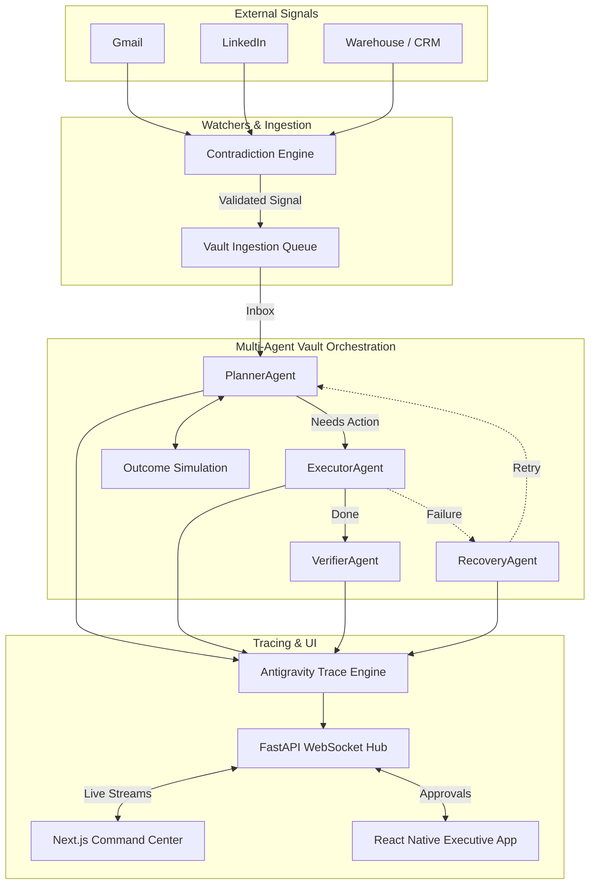

<div align="center">
  
  
  # ANTIGRAVITY OPERATIONS
  ### The Autonomous AI Enterprise Operating System

  [](https://hackathon.withgoogle.com/)
  [](#)
  [](#)
  [](#)
</div>

---

## 🚀 The Post-Automation Era is Here

**Antigravity Operations** is not a chatbot. It is not a static workflow dashboard. It is a living, breathing **Autonomous AI Employee** engineered to run enterprise operations.

Designed specifically for the Google Antigravity Hackathon, this system demonstrates complete, observable, and autonomous agentic reasoning. It ingests signals (emails, API alerts, WhatsApp messages), debates internally, plans execution, handles contradictions, recovers from failures, and produces measurable business value without human intervention—unless executive approval is required.

---

## 🌟 Core Innovations

### 1. **Antigravity Trace Engine**
A real-time WebSocket pipeline that exposes the AI's internal monologue. Watch as the system streams its **Observations**, **Confidence Scores**, **Rejected Paths**, and **Execution Latencies** live to the Command Center.

### 2. **Cinematic Live Command Center**
A Next.js, Framer-Motion powered dashboard that feels like mission control. It visualizes the multi-agent orchestration swarm, active workflows, and system health in a stunning glassmorphic UI.

### 3. **Contradiction Detection Engine**
Intelligently cross-references multi-modal inputs (e.g., a supplier email vs. warehouse CRM data). It identifies duplicates, scores misinformation probability, and proposes investigation actions before blindly executing tasks.

### 4. **Outcome Simulation Engine**
Before executing any high-stakes action, the AI simulates the outcome, projecting **Estimated Cost**, **Latency**, and **Revenue Impact**. The CEO can swipe to approve or reject these simulated plans via the mobile app.

### 5. **Vault-Based Claim-by-Move Orchestration**
Instead of brittle API-to-API state machines, Antigravity uses a robust Markdown Vault. Agents (Planner, Executor, Verifier, Recovery) coordinate through an elegant claim-by-move file system that provides an automatic, human-readable audit trail in Obsidian.

---

## 🏗️ Architecture Diagram



---

## 📱 Executive Mobile App

Antigravity comes with a premium **React Native Expo** application designed for the modern CEO. 

- **Live System Health**: Monitor AI load and latency from your pocket.
- **Approvals Queue**: Swipe right to approve high-stakes AI plans (e.g., contracting a $12k alternative supplier during a crisis).
- **Mobile Thought Stream**: Keep a pulse on the AI swarm's internal reasoning.

---

## 🎬 Demo Mode Scenarios (One-Click Crisis Testing)

We built an injection engine to prove the system's resilience under fire. From the Command Center, judges can trigger:

1. **Supplier Failure**: Triggers an urgent bankruptcy alert, forcing the AI to locate alternative suppliers and draft contracts.
2. **Inventory Crisis**: Injects a 0-stock alert, waking up the PlannerAgent to coordinate emergency logistics.
3. **Escalated Complaint**: Simulates a high-value enterprise client churning, triggering the Social and Communications agents to execute PR mitigation.

---

## 🛠️ Tech Stack

- **Reasoning**: Cohere `command-a-03-2025`
- **Orchestration**: Python, FastAPI, Vault-based state machine
- **Command Center**: Next.js 14, Tailwind CSS, Framer Motion, Lucide Icons
- **Executive Mobile App**: React Native, Expo, Reanimated
- **Observability**: Custom Antigravity WebSocket Trace Engine

---

## 🚀 Getting Started (Local Deployment)

Antigravity Operations requires Python 3.11+, Node.js 18+, and a Cohere API Key.

### 1. Backend & Orchestration
```bash
# Install dependencies
python -m venv venv
source venv/bin/activate  # or `venv\Scripts\activate` on Windows
pip install -r requirements.txt

# Start the FastAPI Server, Vault Runner, and WebSocket Hub
./start_backend.bat  # (or uvicorn api.server:app --reload)
```

### 2. Next.js Command Center
```bash
cd dashboard
npm install
npm run dev
# Open http://localhost:3000
```

### 3. React Native Mobile App
```bash
cd mobile
npm install
npx expo start
# Scan the QR code with Expo Go on iOS/Android
```

---

## 🏆 Hackathon Alignment Statement

This project explicitly over-delivers on the Google Antigravity Hackathon's prompt: **"Autonomous Content-to-Action Agent"**. 

It goes beyond simple automation by providing **visible reasoning**, **outcome simulation**, **contradiction detection**, and a **multi-agent self-healing loop**. It demonstrates that AI can move past the "Copilot" era and into the "Autonomous Digital Employee" era, managed entirely through intuitive, cinematic interfaces.
